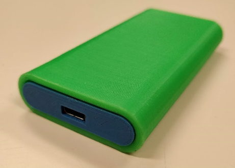
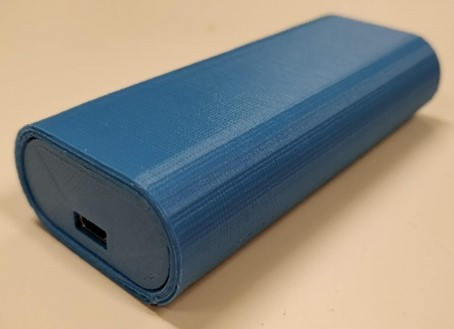
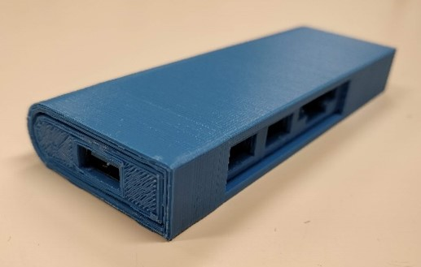
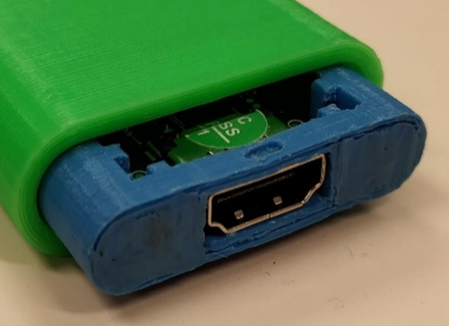
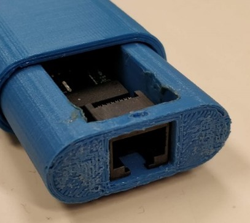
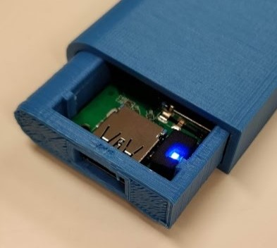

# USB-C Adapters: Design improvement using a 3D printer

### **Status: Work in progress**

HDMI | Ethernet | USB-A + SD
:---:|:--------:|:----------:
 |  | 
 |  | 

## Research Question

> _"How can we improve the design of USB-C adapters to increase their durability and versatility?"_

<!-- ## Motivation -->

